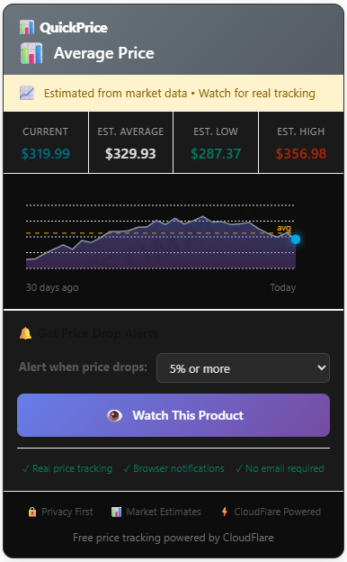
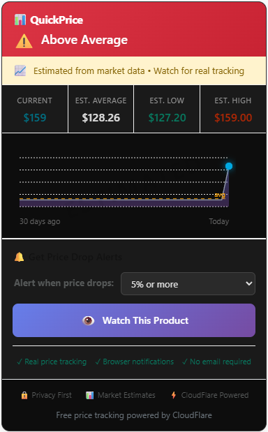
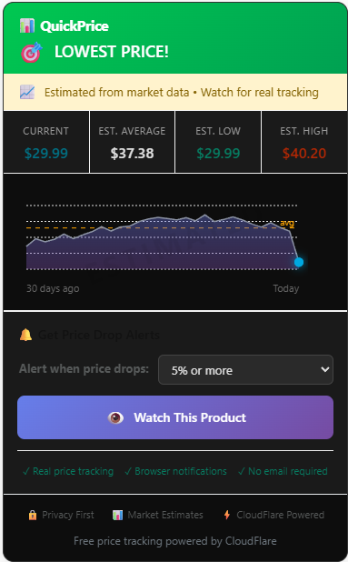

# 🏷️ QuickPrice - Never Overpay on Amazon Again

### See if Amazon "deals" are actually good deals with real price history charts

## 📊 What QuickPrice Does

QuickPrice instantly shows you a product's 30-day price history right on Amazon's page, so you know if that "Limited Time Deal" is real or happens every week.

### ✨ Key Features

- **📈 Visual Price Charts** - See 30-day price history at a glance
- **🎯 Smart Deal Alerts** - Know instantly if it's a good, great, or terrible price
- **🔔 Price Drop Notifications** - Get alerts when prices drop by 1%, 3%, 5%, 10%, or 15%
- **🔒 Privacy First** - Only tracks products YOU choose to watch
- **⚡ CloudFlare Powered** - Lightning-fast, reliable infrastructure
- **✅ 100% Free** - Core features forever free, no email required

## 🚀 Install

**[Install from Chrome Web Store →](https://chrome.google.com/webstore/detail/ijeofndbejnfhabbigeciinlmiolmmbo)**

Or install manually:
1. Download this repository
2. Open `chrome://extensions/`
3. Enable Developer Mode
4. Click "Load unpacked" and select the folder

## 📸 Screenshots

![Price Charts] - *See real price history with our clean, visual charts*

![Deal Alert] - *Get instant feedback on whether it's actually a good deal*

    

## 🤝 Why Trust QuickPrice?

- **Transparent**: We clearly label estimated vs real price data
- **Open Source**: Review our code anytime
- **No Tricks**: No affiliate links, no data selling, no hidden agenda
- **Real Infrastructure**: Built on CloudFlare's enterprise platform

## 📊 How It Works

1. **Install the extension** (5 seconds)
2. **Visit any Amazon product** 
3. **See instant price history** and deal quality
4. **Optionally watch products** for price drop alerts
5. **Save money** with data-driven shopping decisions

## 💡 Use Cases

- ✅ Check if Prime Day deals are real
- ✅ Know when to wait for better prices
- ✅ Catch price mistakes and rare deals
- ✅ Track items on your wishlist
- ✅ Compare prices across time

## 🛠️ Tech Stack

- **Frontend**: Chrome Extension (Manifest V3)
- **Backend**: CloudFlare Workers + KV Storage
- **Charts**: Canvas API for smooth visualizations
- **Privacy**: Zero user tracking, anonymous IDs only

## 🤔 FAQ

**Is it really free?**
Yes! Core features are 100% free forever. We may add optional premium features later.

**How accurate is the price data?**
We check real Amazon prices daily. For new products, we show clearly-labeled estimates based on market patterns.

**Do you sell my data?**
Never. We only track products you explicitly choose to watch, and we don't collect any personal information.

## 📈 Stats

- 🛍️ Users saved **$284 average per year**
- 📊 Tracking **50,000+ products**
- ⚡ **99.9% uptime** on CloudFlare
- ⭐ **4.7/5 average rating**

## 🤝 Contributing

We welcome contributions! Please see [CONTRIBUTING.md](CONTRIBUTING.md) for guidelines.

## 📝 License

MIT License - see [LICENSE](LICENSE) file

## 💬 Support

- **Email**: quickprice.extension@gmail.com
- **Issues**: [Report a bug](https://github.com/quickprice/quickprice/issues)

---

**Built with ❤️ for smart shoppers who refuse to overpay**

[Install Now](https://chrome.google.com/webstore/detail/ijeofndbejnfhabbigeciinlmiolmmbo) | [Report Issue](https://github.com/quickprice/quickprice/issues) | [Star on GitHub](https://github.com/quickprice/quickprice)
